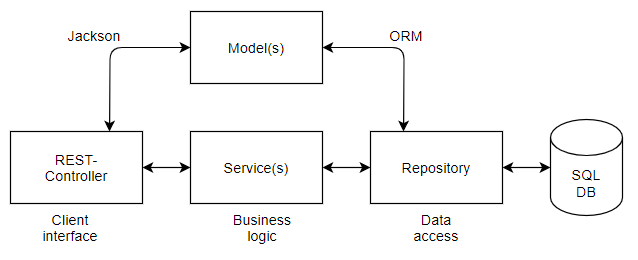

# ALSA Weather API - Cloud project

#### Technology Stack| `Languagues and Tools`

>        

---


# Table of contents <!-- omit in toc -->

- [1. About ALSA Weather API](https://github.com/ALSA-Tech/ALSA_weather_server#1-about-alsa-weather-api)
- [2. Architectural Approach](https://github.com/ALSA-Tech/ALSA_weather_server#2-architectural-approach)
- [3. Security](https://github.com/ALSA-Tech/ALSA_weather_server#3-security)
  - 3.1 Data transfer (HTTPS)
  - 3.2 Data storage (hashing)
  - 3.3 Client authentication (login)
- [4. Server](https://github.com/ALSA-Tech/ALSA_weather_server#4-server)
  - 4.1 Architecture
  - 4.2 Client endpoint
  - 4.3 SMHI API
  - 4.4 Database
  - 4.5 Deploy
  - 4.6 Automation: CI/CD
  - 4.7 File structure
- [5. Client](https://github.com/ALSA-Tech/ALSA_weather_server#5-client)
  - 5.1 File structure
---

<br>

# 1. About ALSA Weather API

ALSA Weather API is a software suit for subscribing and searching for top temperatures at geographical locations. The API is open for searches on locations, but requires an account and authentication for subscribing to locations. For each location, the ALSA API returns the top temperature for each day over the coming 9 days.


# 2. Architectural Approach

The software suit includes a public RESTful server deployed on a Linux VPS (IaaS), and a desktop GUI application for graphical displays of API data.
Mainly, the cloud service receives a search for a location as a String, derives its longitude and latitude coordinates, makes a request to SMHI API, and then derives and returns top temperatures for the coming 9 days from that data. The client application displays the data in graph format. On top of that, accounts can be registered for subscribing to multiple locations, for which login is prompted.

The server applicaiton is developed using Java with Spring Boot. It is deployed on a Linux VPS (IaaS), and communicates with an Azure SQL database (PaaS). The client application is a desktop application developed with JavaFX.

# 3. Security

## 3.1 Data transfer (HTTPS)
The server application is made publicly accessible via *NGINX* reverse proxy server. NGINX provides security both for clients and the server itself. It acts as a centralized endpoint and gatekeeper for all interactions with the server machine, and inspects the requests before internal server routing. 

NGINX enforces HTTPS on all communication with the server machine. This is done using *certbot*, which in turn manages TLS certificates from *Let’s Encrypts* (Certificate Authority). For TLS certificates, a domain name was created and registered to a DNS name server. In short, all data transferred on the public Internet is encypted, while all data being routed internally within the server machine is plaintext.

## 3.2 Data storage (hashing)
Password is stored in the database with a custom Bcrypt XOR hash. A 16 Byte Salt is generated with "SHA1PRNG", A specific Hash key 512 long is then generated from the original password, the salt, number of iterations. Password is then generated into a byte hash from "PBKDF2HmaxSHA512" encoding. Salt is then encoded with a base64Encoding. The Password hash is Xor encrypted with the salt and later encrypted again with Base64Enconding. Generating an hard encoded hash string the require multiple breaksdown to get the orginial password. This also makes it that every hash stored in the database will look different and no hash string will be displayed the same way. If database is breached.

```java
    public String generateHash(String password) {
        try {
            int iterations = 65536;
            byte[] salt = getSalt();
            PBEKeySpec spec = new PBEKeySpec(password.toCharArray(), salt, iterations, 512);
            SecretKeyFactory skf = SecretKeyFactory.getInstance("PBKDF2WithHmacSHA512");
            byte[] hash = skf.generateSecret(spec).getEncoded();
            return iterations + ":" + base64Encode(salt) + ":" + base64Encode(xorWithKey(hash,salt));
        } catch (NoSuchAlgorithmException | InvalidKeySpecException exception) {
            exception.printStackTrace();
        }
        return null;
    }
```
Hash string Iteration:Endcoded salt: Encoded XOR encryppted Salt Hash
<pre>
"65536:GaoEQQEDpZHx7Qg6V6wVWQ==:ZyYCPbjr26SA/N4JEf4LMjHcsN5EH3ea1UYvKjhTXTxPBlkBKTwdjb7O4nrP9c/P3UWIhVxfxywAk0VO+uc39A=="
</pre>
## 3.3 Client authentication (login)
Before the client accesses web resources, they have to provide a username and password via HTTP authentication,
comparing provided client password with hashed value in the cloud database. Upon a successful login a session attribute
will be created and associated with the client. Since HTTP is stateless (no session information is retained by the receiver), there is no way to associate a request 
to any other request and thus we need a way to identify the current user accessing our system. 
This will help us protect routes by keeping track of user privileges and access to resources.

# 4. Server

## 4.1 Architecture

The server application (backend) is developed using Spring Boot. It therefore centres around the Spring container, which is responsible for instantiating controller and service classes (as _beans_) which can be injected (_autowired_) using dependency injection. This is convenient as it reduces code and object management. From a programmer perspective, it also provides clarity as the class annotations used clearly specifies the purpose of a class (controller/service/repository/model etc.).

The server application provides a RESTful API as endpoint for client interactions. The API exposes the supported server features, and uses HTTP Session objects for gatekeeping, so that certain features may only be served to logged in clients. Other than that, the REST controller quickly delegates job to a Service instance. The service instance handles the business logic of processing and/or routing requests correctly inside the server application. The service instance is also the one that makes data access requests to the database manager instance, which in Spring JPA terms is known as a repository. Creating clear separations of concerns is good both for security and for delegations of tasks among team members, as it creates isolated and specific instances.

So, the server application has an HTTP endpoint dealing with requests and responses in JSON format, as well as a backend database communication interface. However, because of the use of Jackson and ORM, manual object mappings in JSON or SQL queries is rarely needed. This reduces repetitive code, and creates a much slimmer and clearer code base.

The figure below illustrates an abstraction of the dataflow when serving a client request.



## 4.2 Client endpoint
The client endpoins uses the RESTful API architectural style, where HTTP requests
are used to access resources provided by the web server. In the web server, endpoints are setup
in the same way where routes specify what type of CRUD method its expecting on a predefined
URL. REST technology uses less bandwidth, making it suitable in comparison to other techniques and
serves the client application efficiently.

## 4.3 SMHI API

The appication is exposed to an open API provided by SMHI _(Sveriges meteorologiska och hydrologiska institut)_.
To fetch data from the API one needs to provide longitude and latitude of the desired location. This is implemented by requesting geo-location data from an OPEN Map API that responds with data information in a JSON format of that specific location requested. Longitude and Latitude are then filtered out and sent to the SMHI API. Open Map API is used instead of standard Google Map API as it would require credit credentials, and still generated the same precision and information.  
<br>
An example of data that is sent fetched when contacting the SMHI API can be seen _[here](https://opendata-download-metfcst.smhi.se/api/category/pmp3g/version/2/geotype/point/lon/13.766765/lat/56.158913/data.json)_
<br>
<br>
As one can see in the data fecthed, it contains not only temperature, but also air pressure, wind direction, wind speed, relative humidity, and more. Therefore when retrieving the data the server must filter it to only find the temperature data for each day in the 10 upcoming days. Thereafter, the server must also do calculations on what the highest temperature is for each day. When the calculations have been made a List is sent back to the client containing all necesary data for it to be displayed in a graph.
<br>
<br>
Since the SMHI API does not have worldwide coverage it might not always get a response that should be displayed to the client, therefore error-handling has been implemented in a way that whenever an error occurs, an appropiate message is sent back to the client giving them information on what the problem was.

## 4.4 Database

The server application communicates with a Microsoft SQL database provided as PaaS by Azure. The PaaS database service provides a production-ready database with ready-to-go configurations for connectivity and security. There is also the option to scale the virtual resources to fit the needs of the use case. Using a PaaS also means that the developers can focus on business logic, rather than service management. Another key factor is that a PaaS runs as a dedicated and isoloated service. For development purposes, this is suitable as all team members require access to the database instance, which in turn requires slightly reducing the firewall security. Since the service is isolated to the database, the risks of this never extends to additional services.

For database operations from the server application, *JPA* (Java Persistence API) with *Hibernate* is used. Because it can be set up with *ORM* (Object-Relational Mapping) and has support for many of the most common database operations, manually typing SQL queries in code is only necessary for very specific database requests. The result is a slimmer and more clear code base. This is done by mapping model classes to database tables.

## 4.5 Deploy

The server application is deployed and managed as a *systemd* daemon on a Linux VPS (IaaS). It utilizes the Spring feature of *externalized configuration files* to automatically run with slightly different settings on the server as it does when pulling the application from GitHub. This way, there is an automatic distinction between development  mode and production mode. When deployed or redeployed on the server, the application ignores certian configurations in the GitHub project, because externalized files outside of the GitHub project instead takes presence. Hence, when run on the server, the application does not run in debug mode, and it is set to only log crucial data.

As mentioned above (3.1 Data transfer), remote access is governed by NGINX reverse proxy server, which also enforces TLS encryption for HTTPS. 

## 4.6 Automation: CI/CD

*GitHub Actions* is used to automate the workflow of re-building and re-deploying the server application (CI/CD) on the server machine. The [workflow](https://github.com/ALSA-Tech/ALSA_weather_server/blob/master/.github/workflows/deploy.yml) is triggered on each accepted pull request on the repository's master branch. For updating the running server application, SSH was chosen as it allows creating dedicated bash scripts on the server, which the GitHub workflow process can be instructed to execute. This is suitable as the workflow can be divided into distinctive phases, where each phase represents a bash script. Any updates on the workflow process can then be done in these dedicated bash scripts, without revealing the steps outside of the server. It also means that updates on the workflow only needs to be done at one place; on the server, and does not require GitHub changes. To enable automatic server deployment, where the GitHub workflow is allowed SSH entrance to the server machine, RSA-keys were added to the GitHub repository as environment secrets. 

## 4.7 File structure

> Only application specific and central files are mentioned below.

<pre>
📦ASLA_weather_server
 ┣ 📂.github/workflows
 ┃ ┣ 📜deploy.yml                           [CI/CD workflow]
 ┣ 📂config
 ┃ ┣ 📜application.properties               [Gitignored private secrets]
 ┣ 📂src/main
 ┃ ┣ 📂java
 ┃ ┃ ┗ 📂ALSA.weather.server
 ┃ ┃   ┣ 📂clients
 ┃ ┃   ┃ ┣ 📜Client.java                     [Model]
 ┃ ┃   ┃ ┣ 📜ClientController.java           [Client endpoint]
 ┃ ┃   ┃ ┣ 📜ClientService.java              [Business logic]
 ┃ ┃   ┃ ┣ 📜ClientRepository.java           [Data access]
 ┃ ┃   ┃ ┗ 📜ClientNotFoundException.java    [HTTP error msg]
 ┃ ┃   ┣ 📂locations
 ┃ ┃   ┃ ┣ 📜Location.java                   [Model]
 ┃ ┃   ┃ ┣ 📜LocationService.java            [Business logic]
 ┃ ┃   ┃ ┣ 📜LocationDataXY.java             [Model]
 ┃ ┃   ┃ ┗ 📜LocationNotFoundException.java  [HTTP error msg]
 ┃ ┃   ┣ 📂spring_example                    [Example code]
 ┃ ┃   ┣ 📂utils
 ┃ ┃   ┃ ┣ 📜MapUtils.java                   [Util]
 ┃ ┃   ┃ ┣ 📜ScorpioZHash.java               [Util]
 ┃ ┃   ┃ ┗ 📜StringListConverter.java        [Util]
 ┃ ┃   ┗ 📜AlsaWeatherServerApplication.java [Spring driver class]
 ┃ ┣ 📂resources
 ┃ ┃ ┗ 📜application.properties              [Public configs]
[...]
 </pre>

# 5. Client
- **Features**
    - *Registration account*
    - *Login*
    - *Search weather location*
    - *Offline functionality*
    - *Subscribe weather locations*
    - *Visualize weather data graphical*

- **Client Architecture**
    - *Maven* - Using maven as a framwork for implemting JavaFX build modules, GSON and simpel JSON parser libraries, for manipulating class data into a simpel json format och parsing json data from the server responses.
     - *Java FX* - GUI is built as a native desktop Application with Java FX framework. Simpel CSS for styling buttons and layout.
     - *MODEL-VIEW-CONTROLLER (MVC)* - Client is built after the MVC pattern splitting controllers, views and logic into seperate modules for easy access and work flow.
     - *HTTPController* - Is the core Core of the communication with the server, it uses generic post and get methods that only communicate in Json format and can then be used for any type of data that needs to be sent or requested. The Class also implements a coockiemanager for handling fast access of the session coockies set by the server when a user log in.
     - *OFFLINE* - If no connection with the server, offline functionality will be open for use. Every time loged in and weather data is requested it is stored in local cache files on the users computer. This is then read into the graph view for easy and fast access. This works good as the data requested is a forecast for 10 days.
    - *Platform Independent* - The Application is platform independed as it is a Java jar exe file. It can be moved between computer and run directly as long as the Java virtual machine is installed on that specific computer. 
## 5.1 File structure

<pre>
📦ASLA_weather_client
 ┣ 📂Controller
 ┃ ┣ 📜LoginController.java
 ┃ ┣ 📜OfflineController.java
 ┃ ┣ 📜PrimaryController.java
 ┃ ┣ 📜RegistrationController.java
 ┃ ┣ 📜UserController.java
 ┣ 📂models
 ┃ ┣ 📜Client.java
 ┃ ┣ 📜Location.java
 ┃ ┣ 📜LocationDataXY.java
 ┣ 📂utils
 ┃ ┣ 📜HTTPController.java
 ┃ ┣ 📜InputController.java
 ┃ ┣ 📜StringResource.java
 ┃ ┣ 📜WriteReadFiles.java
 ┣ 📜App.java
 ┣ 📂resources
 ┃ ┣ 📂fxml
 ┃   ┣ 📂fxml
 ┃     ┗ 📜login_pane.fxml
 ┃     ┗ 📜offline_user.fxml
 ┃     ┗ 📜registrations_pane.fxml
 ┃     ┗ 📜user_pane.fxml
 ┃     ┗ 📜primary.fxml
 </pre>
